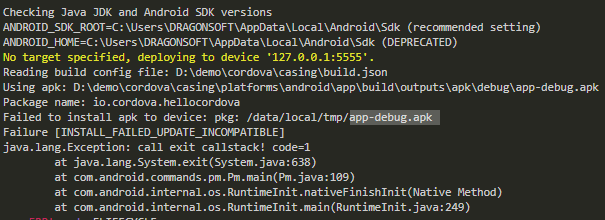

## cordova
### 1. 中文路径错误
```
## 添加 platforms/android/gradle.properties
android.overridePathCheck=true
```

### 2. 模拟器或真机中安装有 app-release.apk (数字证书)，无法再安装 app-debug.apk (测试)，需要手动删除



## yarn
### 1.代理问题
```
## 淘宝代理
yarn config set registry https://registry.npm.taobao.org

## 默认代理
yarn config set registry http://registry.npmjs.org 
```
